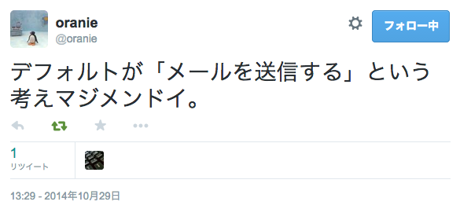

# 出、出〜
# Mackerel課金奴〜
yokohama.pm #12 @ kayac

id:myfinder

___

# kayacさん上場めでたい

___

# 自己紹介
- id:myfinder
 - まいんだー
- エム・ティー・バーン株式会社
 - サーバサイド / Android

---

# 先にお知らせ

___

# MySQL Casual Talks vol.7
- 12/12(金)開催
- トーク/LTネタがある方はお気軽にご相談ください^^

---

# 今日話すこと
- "どオンプレ環境"で作ったサービスを最近 AWS に移設しました
- 移設するにあたって、Mackerel 使い始めました
- Mackerel の Perl クライアントがなかったので書きました、育てていきたいです
- Mackerel でとても捗っています

___

# 対象のサービス
## http://mtburn.jp/

___

## メディア企業の皆様
# どしどしお申込み
# ください

___

## 取り急ぎ社会人としての勤めを果たした

---

# Mackerel
# 使ってますか？

---

# 実際Mackerel
# どんなもんよ
- 実際運用しているやつから

___

# グラフの連続性

___

## 当初8ノードで運用開始

___

## その後4ノードに変更

___

## roleベースでグラフは継続

___

# CloudWatch 連携

___

## 公式の手順でカジュアル

___

# Norikra
# to
# Mackerel

___

## fluent-plugin-(norikra|mackerel)でイナフ

___

## 分速で売上/支払を見る

___

## ホスト登録 は
## cloud-init で
## mackerel-agent を
## install すればイナフ

---

# Mackerel + Slack

携帯がアラートメールでうめつくされるみたいなのもなくなった

___

## "デフォルトでSlack"

___

# アラートメールに消耗するのはもうやめよう

---

## WebService::Mackerel

___

- 内部のCLIツールから投稿するときとかに組み込みやすいようにCPANに上げました
 - バッチの実行時間記録とかから使ってます
- EC2の起動/停止時に自動的にMackerel側に操作を投げたり、各所でメトリクスを投げられるように継続改善したいところです

---

# まとめ

- "どオンプレ環境"で作ったサービスをAWSへ移設
- 移設にあたって Mackerel 使い始めました、はかどってます
- MTBurnはサーバサイド/スマートフォンのエンジニアを募集してます
- MySQL Casual もよろしくお願いします

---

# 質疑など?

---

# おわり
